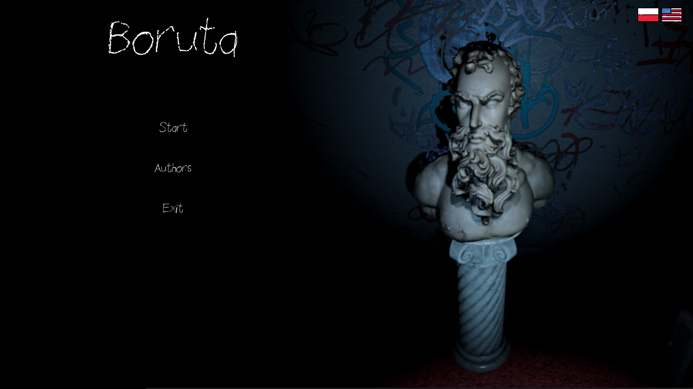
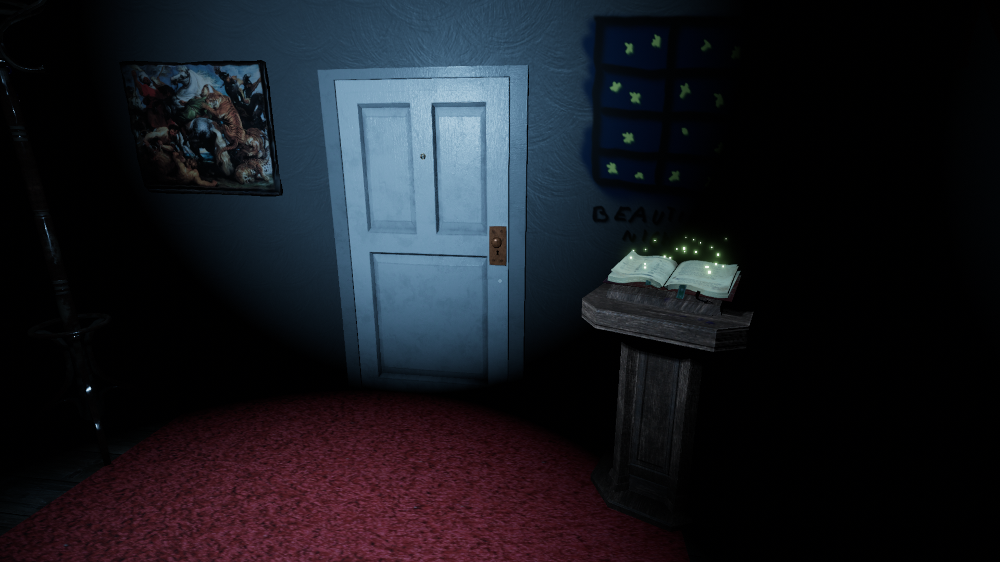
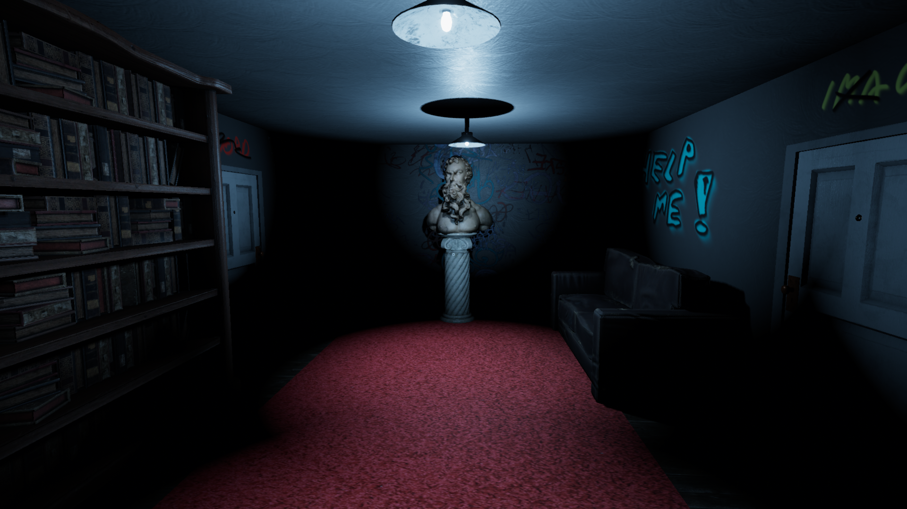
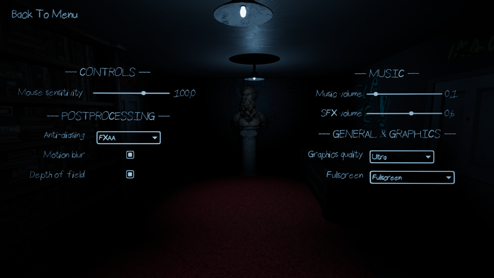

# **Boruta**

## Description

Climatic game in which player explores abandoned wooden house in the middle of the forest. We can search four rooms, where left notes will tell us stories of four different characters. Game time is about 1 hour. You can download the game for free [here](https://thelucifer.itch.io/boruta).
## *Main Menu*
In the main menu of the application, the player is able to receive information about the controls in the game, meet the authors, as well as change the language version (Polish voice over with English subtitles is currently available).

     

## *Game*

During the game, moving around the dark house, the player looks for notes hidden in the corners of the entire building. There are four rooms in the house, each belonging to a different person. As you collect the notes, you learn about the characters' stories - and why you are in such a dark place.

     

## *Settings*
During gameplay, the player is able to change the graphics settings of the software - basically graphics are set to ultra and post-processing is enabled.

     

## Authors
    Author - Patryk Bożek

    Scenario - Patryk Bożek
### *Music*
    Game-in Music by yd from OpenGameArt
    Menu Music by JuliusH from Pixabay
    Outro Music by enrique27naveda fromPixabay
    Intro Music by Lesfm from Pixabay
### *Voice over*
    Outro voice over by bartesek from Fiverr
    Intro voice over by arsib101 from Fiverr
### *Icons*
    America flag by Good Ware from Flaticon
    Poland flag by Freepik from Flaticon
### *Graphics*
    Intro boards by yusnai from Fiverr
### *Textures*
         -------- MYFREETEXTURES.COM -------- 
    "Rendered Torn Wallpaper Paper Background Texture"
### *Sounds*
         --------       FREESOUND.ORG       --------
    "Door Opening" by iamaviolin
    "Door Locked" by BenjaminNelan
    "Object_Drawer_Wood_Open.wav" by Nox_Sound
    "Door, Front, Opening, A" by InspectorJ
    "Door, Front, Closing, A" by InspectorJ
    Fire in the stove by mcmikai
    Footsteps walk by Nox_Sound
### *Models*
         --------       SKETCHFAB.COM       -------
    "Old Book" by g.saintecatherine
    "Old Desk Lamp" by Maxence Rouillet
    "Luger - Game ready asset" by Burdock
    "Doric Twist Pedestal" by Nikkip
    "Figurehead of HMS Thames, 1823" by Thomas Flynn
    "letter from a murderer" by Enshin
    "Simple Wooden Picture Frame" by Nicholas Record
    "Persian Rug" by Nicholas Record
    "1930s style typewriter - w/o branding" by Kuba Wójcik
    "Realistic M1 Garand" by Raymond
    "Old Books" by Zian
    "Stack Of Old Books" by Arjun Perayil
    "Pile of books" by Brenwltrs
    "Floor Lamp" by bilgehan.korkmaz
    "Lamp Ceiling - FNaF" by Glitch5970
    "Statue Of Liberty" by Gravity Jack
    "tobacco smoking pipe" by mhanna
    "Broken Window 07" by Game Ready Art
    "Old wall clock" by AndreiVNK
    "Papers" by I am Cassia
    "Key" by eucocker
    "Simple old shotgun" by SuperMopsek
    "Envelope" by RED2000
    "Small rocks" by doctorchorizo
    "Trim Sheet  Example Dresser" by Chris Sweetwood
    "Old Wooden Wardrobe" by Rodion Perovsky
    "Victorian Lounge Sofa" by Jamie McFarlane
    "Victorian Desk" by Faheem Yusuf
    "Victorian Chair" by Jamie McFarlane
    "Table and Chairs" by Graham
    "Unseen: Fancy Bed" by JmCVoyager
    "Bookcase" by Brenwltrs
    "Old fashioned globe" by rebeccafuller
    "Rocking chair" by Gennady.Tihonov
    "Fancy Picture Frame" by Jamie McFarlane
    "Painting Lowpoly" by BaptisteBerard
    "Inkwell" by stevenharmongames
    "Victorian Abigail Hat" by Tijerín Art Studio
    "Old Pen" by djetty
    "Daily Mirror-1930 Newspaper" by WENGA
    "Embossed Brown Leather Journal" by Arkify
    "Easel Low Poly" by Marcin.Kwiatkowski
    "Blank Canvas" by SM5 by Heledahn
    "Wooden Table" by shedmon
    "Wooden Table" by FlukierJupiter
    "paint brush" by Benjamon321
    "Log Book" by IUPUI University Library
    "Tavern Stool" by Thunder
    "Colt Peacemaker SAA CO2" by grootgroot
    "Teuchun Easel" by Teuchun
    "Old Wooden Grand Piano" by Mikael H.
    "Note Stand" by djgytis231
    "1D FRIEZE collection for free" by 1d_inc
    "Oil Painting of Peaches" by IUPUI University Library
    "Commode / chest of drawers" by theovasilis
    "Dresser" by mikotosnow
    "bookshelf" by filthycent
    "Dusty Old Bookshelf (FREE)" by Brandon Westlake
    "Gothic Chair" by Dirtrock
    "Coat Rack" by Whostea
    "[CCO] Decal - Graffiti Textures" by karlwirbelwind
    "Ornate Mirror" by Arnold Konrad
    "Old Sofa" by glezova
    "Notepad (Bloody)" by Justin.Foley
    "Alchemical book" by Arte Hexe
    "lavender_vase" by Moons
    "The Tiger Hunt Painting" by Austin Beaulier
    "Engle Window Painting" by IUPUI University Library
    "Religious drama" by Geoffrey Marchal
    "Lowpoly Candle" by matoteus
    "Unseen: Bedroom Closet" by JmCVoyager
    "Grandfather Clock" by Lyskilde
    "Warn Wardrobe" by seenoise
    "Fireplace" by Mark Bai
    "Old Flashlight" by Blender3D